# DAP_MERN_ASSIGNMENT_DOCUMENTATION

## Description of your website, including:

### Purpose

The purpose of this project is to create an website for Raw Haricuts that will increase business exposure and revenue. 

#### Functionality / features

The features of the site are intended to showcase the feel for the shop, inform customers on hours and pricing, allow customers to book appointments and check availability, and showcase a gallery of photos of haircut types and examples. 

The functional features will allow customers to check available dates and times to schedule appointments, navigate the site via an easy to use nav/footer bar, and make purchases through a third party portal. The functional features will allow an admin to check and approve appointments for clients. 

#### Target audience

The target audience is males living in the Gold Coast metro-area who are looking for an occaional classic, modern, or specialty styled haircut. 

#### Tech stack

The MERN tech stack will be incorporated into this project, the four open sourced components being MongoDB, Express, React, and Node.js. The noSQL database, MongoDB is utilized in the MERN stack. The backend server utilizes Node.js, Express, and mongoose. The front end utilizes React. 

## Dataflow Diagram	

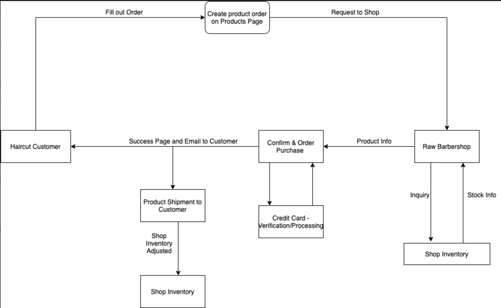

## Application Architecture Diagram	

## Site Map Diagram

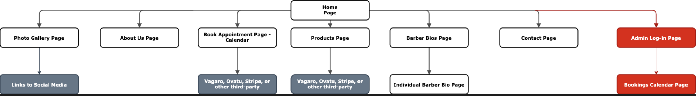

## User Stories	

As Mike,
> I want to be able to view the hours of this business, so I know when the business is open

> I want access to the business's social media and other relevant pages, so I can get a feel for the culture of the business.

As Mark,

> I want to be able to view haircut types and products offered by the business, so I can make an informed decision on what products/services I can purchase.

> I want to see blog with pictures and stories (that can be linked to an instagram), so I can feel the culture of the business.

As James,
> I want to see a short bio on barbers, their credentials and styles, so that I can make an informed decision on choosing a barber.

> I would like a payment screen so I can make advanced purchases for products and haircuts in order to streamline my experience.

As Sam,
> I want to be able to navigate the business's site via a navigation bar, so I can easily move from page to page.

> I want to be able to view a calendar of available appointments, so I can make an informed decision on requesting an appointment.

As Kevin,
> I want to see a gallery page with pictures of the store and other clients' haircuts, so I can get a good feel for the business and its products.

As Nathaniel,
> I want to be able to request more information from the business leaving my email and contact info, so I can learn more about the business.

As the owner,

> I want capabilities to view an admin page from which I can view all appointments and confirm new ones, so I can efficiently schedule.

Initial user stories formed based on an introductory call and email with the client. Formal client business call, client was happy with user stories and discussed functionality of the owner/admins for the site. Added owner user stories: 

As the owner, 

> I want capabilities to view an admin page from which I can create, edit, and delete pictures to a gallery to give patrons haircut examples. 

> I want capabilities to view an admin page from which I can create, update, and remove products from my store to increase sales of my merchandise. 

> I want the capacity to create/send directed emails/texts to my barbers os that they can be notified of changes to the business and their schedule. 

## Wireframes for multiple standard screen sizes, created using industry standard software	

### Initial wireframes

These are the initial wireframes that were designed loosely based on client descriptions. The original design was to be simple and sleek, with a dark palette and minimal style.

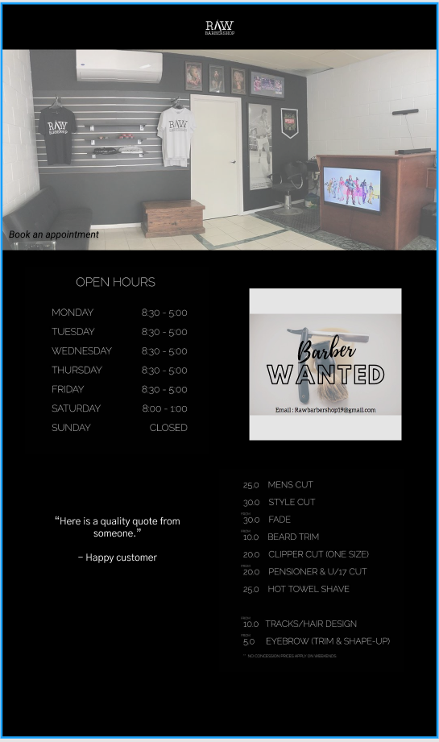

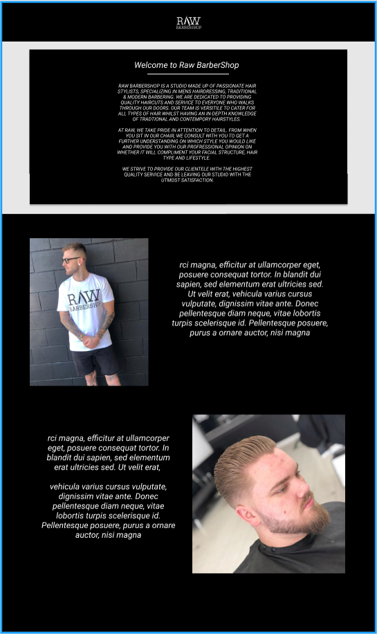

After a meeting with the client and receiving feedback on these designs, the wireframes were then revised and redesigned based on client requests. He specified that he would like to have a lighter theme and a cleaner look.

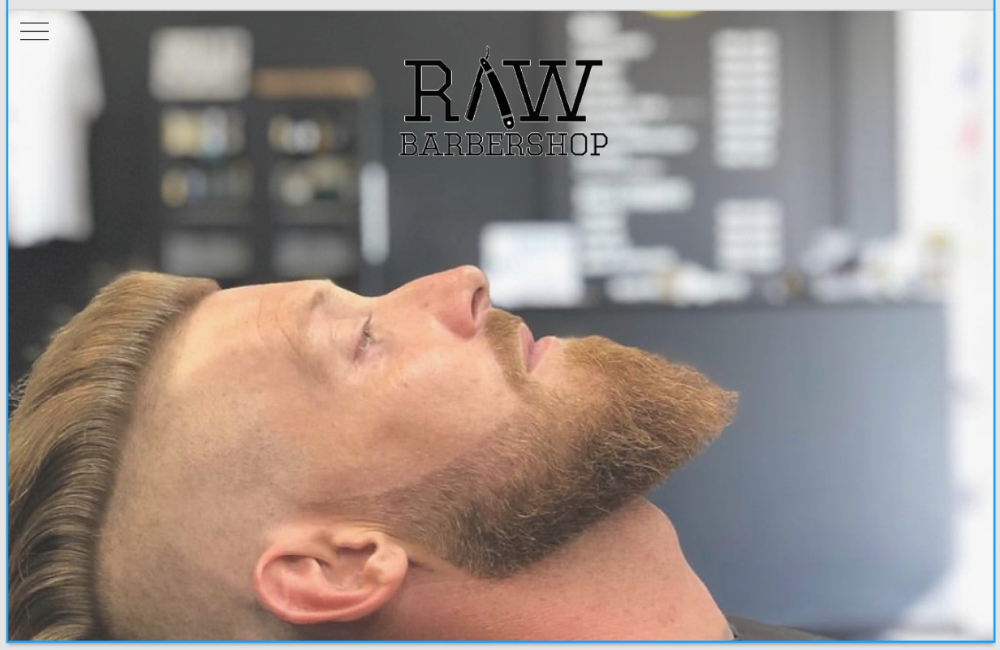

This was the original page but was requested to have the logo colour changed to the following.

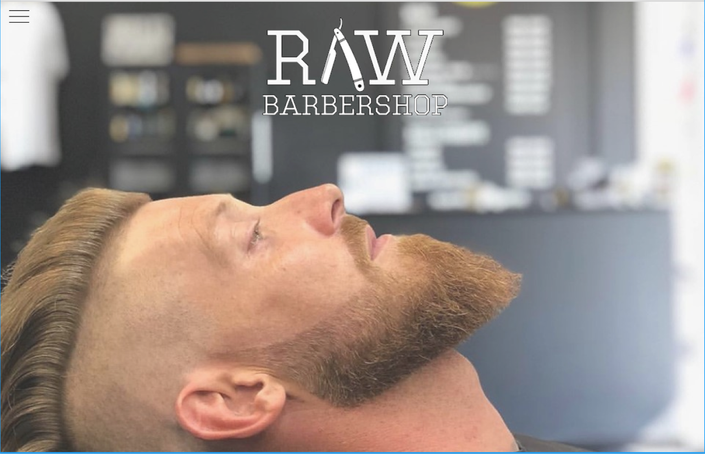

The client also requested that a burger menu be implemented so that the user may be able to navigate throughout the website freely.

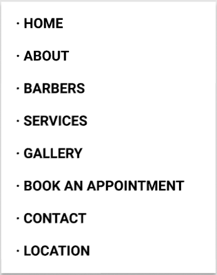

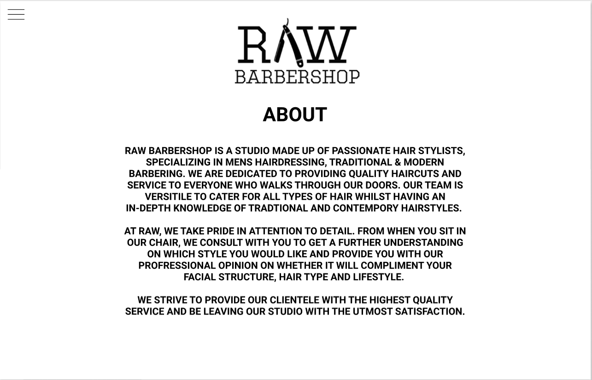

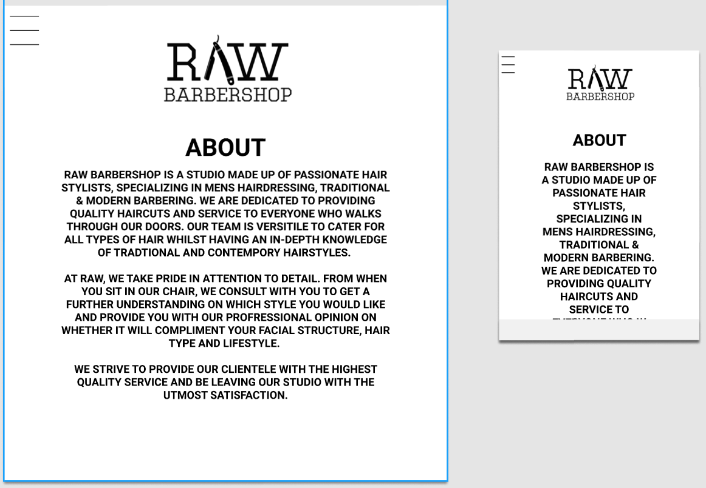

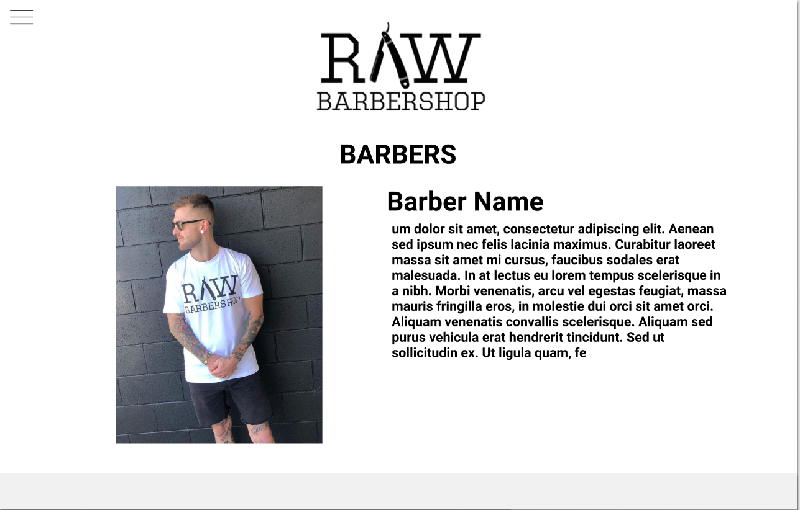

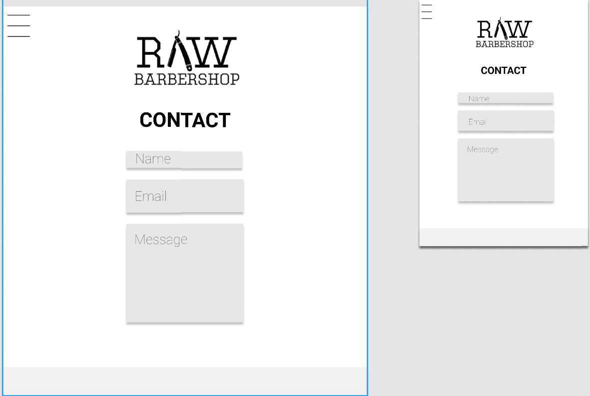

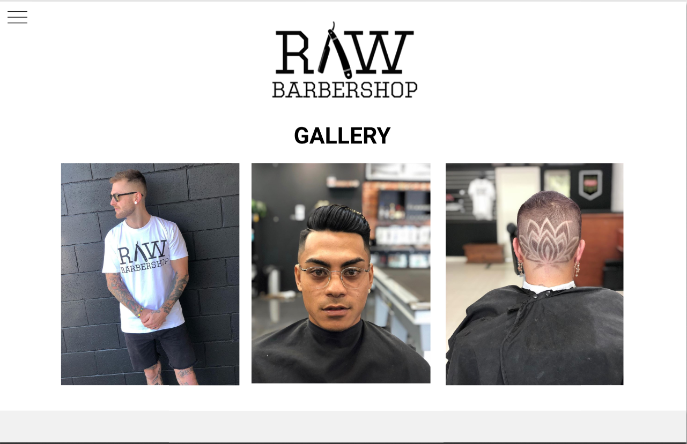

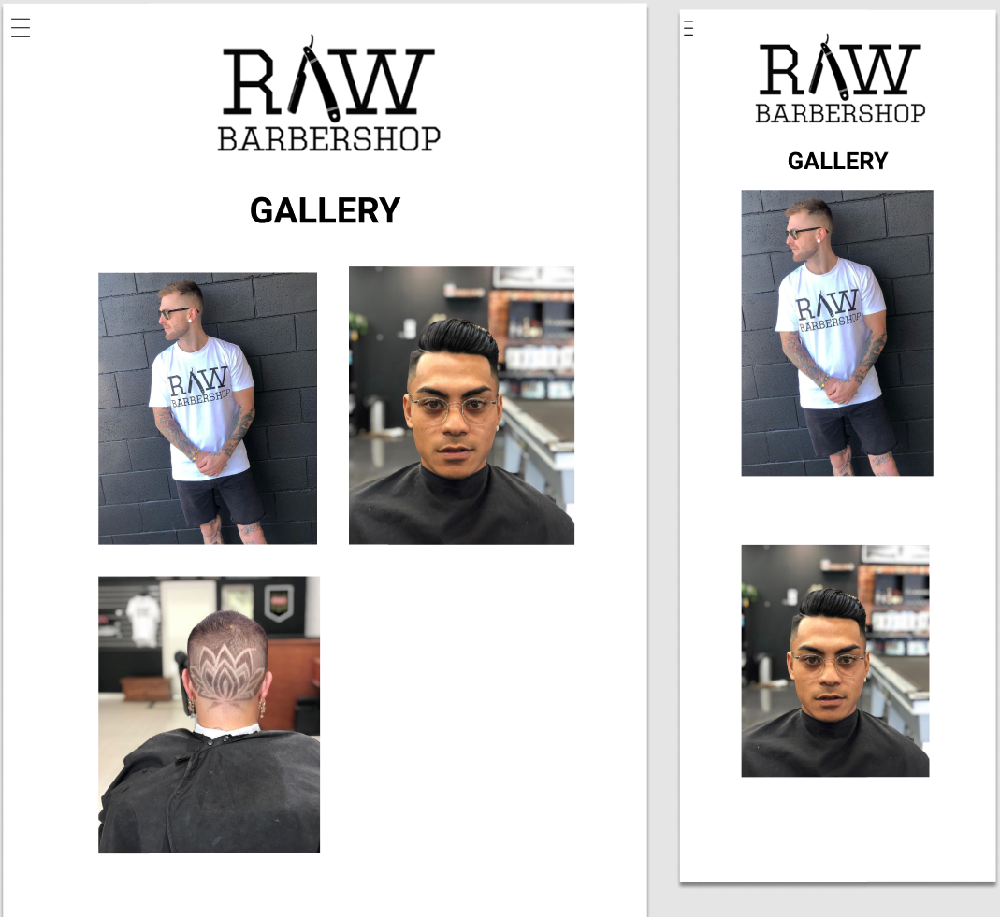

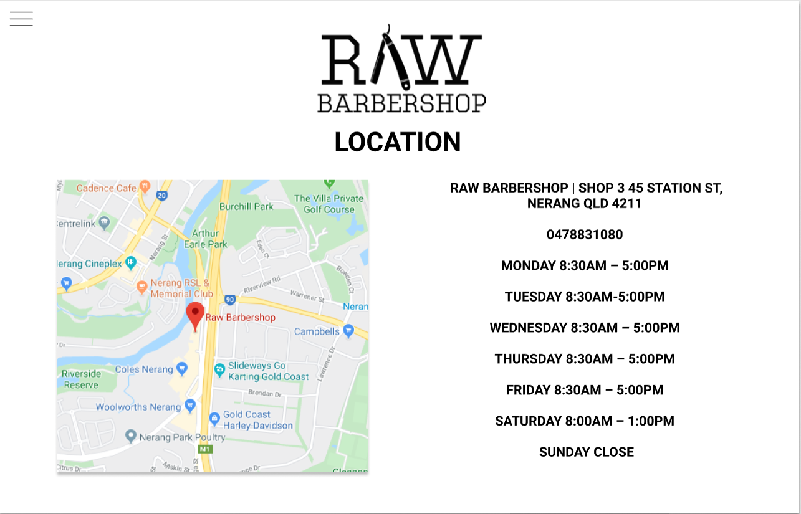

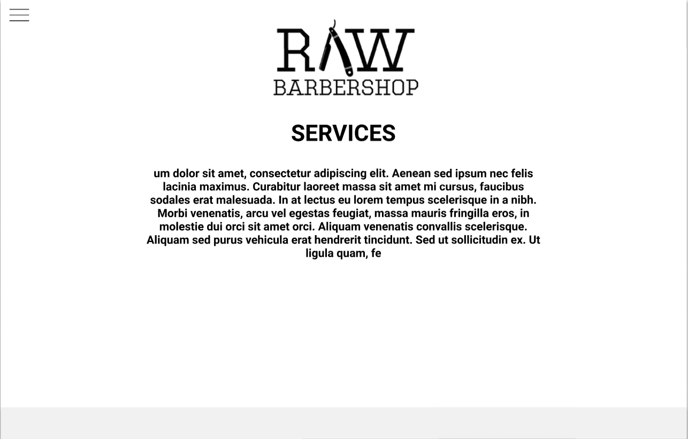

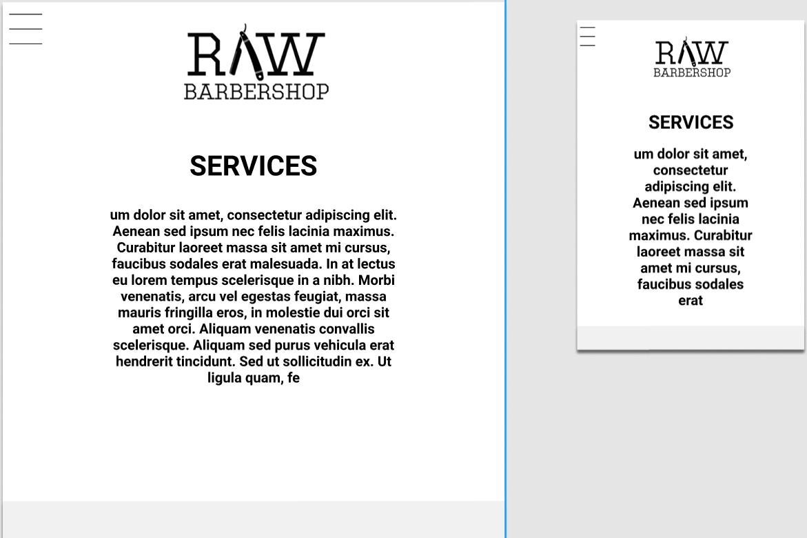

## Screenshots of your Trello board throughout the duration of the project	

The team discussed what project management method would be the most effective 

*13/1/20*

*14/1/20*

*15/1/20*

## Other

[Resources](https://docs.google.com/document/d/1qCIVq4t38VcJ9CifgAuvjDxCgSFbA2Dvnt6x0-GKwyY/edit)

